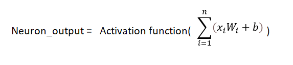
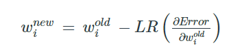
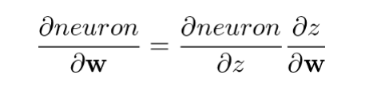
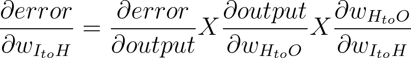

# tsai_end2.0_Session_1
The School of AI repo for END 2.0 Session 1

# What is a neural network neuron?
It is a mathematical implementation of a biological neuron. This is represented as a model where the input data is combined with weights and biases to pass it on as input to the next layer and compute an output for it. These inputs are converted into outputs using a mathematical function which is called an activation function- which is placed outside the neuron along with the weights. The neurons only act as a store of value or placeholder for data temporarily. Generally, for a neuron, the output can be represented by


where Xi is the neuron; Wi is the associated weight; b -s the bias


# What is the use of the learning rate?
Learning rate is a hyperparameter that can be configured to train a neural network. It should be in the range (0,1); excluding the outer-bounds. Count of training epochs will be larger for a very small learning-rate while a larger learning-rate can provide a suboptimal solution (spiraling out of the local minimum) in very few epochs as there will be rapid change in change in weights.



where LR is the learning rate; W's represent the weights. 

# How are weights initialized?
Weight initialization is a procedure to set the weights of a neural network to small random values that define the starting point for the optimization (learning or training) of the neural network model. There are multiple ways to initialise weights such as:
- sampling from a normal distribution with (mean =0, standard deviation = 1). 
- Sampling from a uniform distribution, 
- zeroes, ones
- Or taking a constant number for the weight

Listed above are the most basic ways to initialise the weights, however, there can be multiple more ways to do the same.
The code to initialise weights is below:
```
def weights_init(model):
    for m in model.modules():
        if isinstance(m, nn.Linear):
            # initialize the weight tensor, here we use a normal distribution
            m.weight.data.normal_(0, 1)

weights_init(model)
```

# What is "loss" in a neural network?
Generally, a cost or loss function tells the optimisation algorithm how 'good' the predictions are by seeing the difference between actual and predicted values. These losses are used as a feedback signal, thus updating the weights and biases to have a lower loss in the next epoch as it gives us the measure of mistakes made by the network in predicting the output. Thus, Loss or error is the quantitative measure of deviation between the predicted output and the actual output in anticipation. 


# What is the "chain rule" in gradient flow?
Chain rule in gradient flow is the partial differentiation of the loss/cost function with respect to the weights and biases of individual neurons. Here we assume that, when the weight/bias on one neuron is modified, the weights/biases of other neurons are constant. The gradient of a defined neuron, z, 


will be given as



The chain rule for the error(Loss function) with respect to the weight of neuron 1 in input layer to the 1st neuron in the hidden layer is given by:



We assume that we have only one hidden layer with multiple neurons and only one neuron in the output layer.


